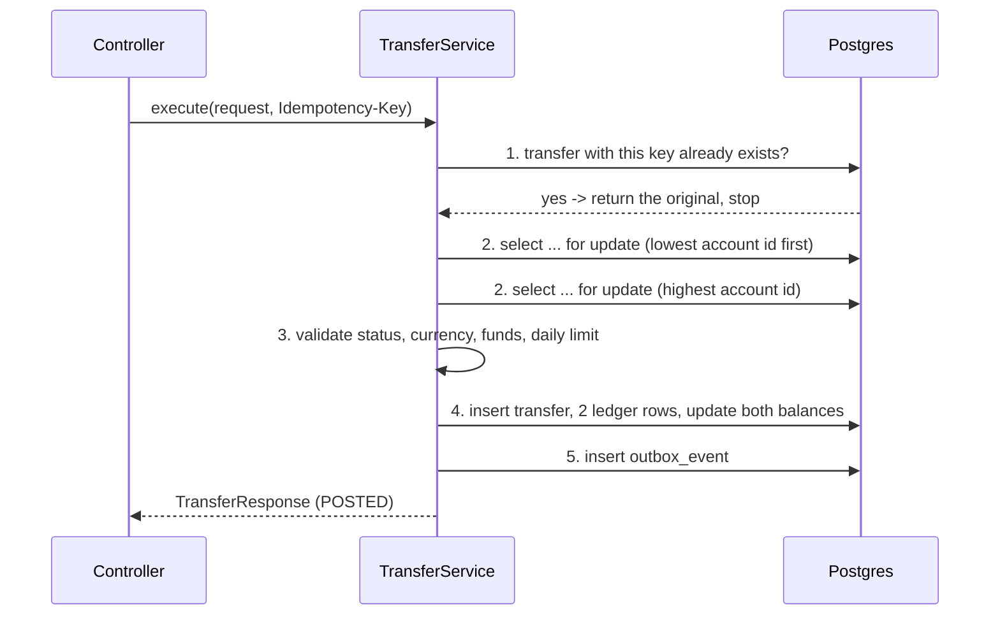

# The Transfer Module

This is the core of the wallet: the code that actually moves money. Everything else
(users, accounts, currencies) exists so that this package has something to move money
between.

It is deliberately more complicated than "subtract from A, add to B". This document
explains what each piece of that complication is defending against.

---

## 1. Why a ledger instead of just a balance

The obvious design is a `balance` column you add to and subtract from. It is also
unauditable: when a customer says "I'm missing 200 EGP", a bare number cannot tell you
what happened.

So the real record is `ledger_entry`, which is **append-only**. Nothing in this codebase
ever updates or deletes a ledger row. Every movement of money creates new rows, forever.

`account.balance` still exists, but it is only a **cached projection** — a fast answer to
"how much is in here right now" that must always be reproducible from the ledger:

```
account.balance  ==  SUM(credits) - SUM(debits)  over that account's ledger entries
```

`LedgerEntryRepository.balanceFromLedger(accountId)` computes the right-hand side. The
tests assert the two sides agree. If they ever diverge, the ledger is right and the
balance is wrong.

### Double entry: why DEBIT and CREDIT

Every transfer writes **exactly two** ledger rows, and they must cancel out:

| Account | Direction | Meaning |
|---|---|---|
| source | `DEBIT` | money leaving this account |
| dest | `CREDIT` | money arriving in this account |

The words come from double-entry bookkeeping, written from the **wallet provider's**
point of view. A customer's wallet balance is not our money — it is a *liability*, money
we owe them. In bookkeeping a liability goes **down** with a debit and **up** with a
credit:

```
Alice sends 20 to Bob
   we owe Alice less  ->  liability down  ->  DEBIT  Alice
   we owe Bob more    ->  liability up    ->  CREDIT Bob
```

This is why your bank statement calls incoming money a "credit" — the bank's obligation
to you went up. It feels reversed only because in your own books cash is an asset, and
assets go up with a debit. Same word, other side of the table.

The schema makes the convention impossible to get wrong:

```sql
direction VARCHAR(6)   NOT NULL CHECK (direction IN ('DEBIT','CREDIT')),
amount    NUMERIC(19,4) NOT NULL CHECK (amount > 0),
CREATE UNIQUE INDEX uq_ledger_leg ON ledger_entry(transfer_id, account_id, direction);
```

Amounts are **always positive** and the direction is explicit, so a sign can never be
misread. The unique index makes it structurally impossible to debit the same account
twice for one transfer.

> Money is `NUMERIC(19,4)` -> `BigDecimal`, never `double`. `0.1 + 0.2` is
> `0.30000000000000004` in binary floating point, and the drift compounds. Compare with
> `compareTo(...) == 0`, never `equals`, because `1.0` and `1.00` are not `equals`.

---

## 2. What `TransferService.execute()` does

All five steps happen inside **one** `@Transactional` method. Either all of it lands or
none of it does.



### Step 1 — Idempotency

The client sends an `Idempotency-Key` header. If a transfer already exists for
(initiator, key), we return **that** transfer instead of making a new one.

This is the single most important behaviour in a payments API. Networks time out. Phones
lose signal. Users press the button twice. Without this, a retried request is a second
payment.

The database is the real guarantee, not the check:

```sql
CREATE UNIQUE INDEX uq_transfer_idem ON transfer(initiated_by, idempotency_key);
```

Two simultaneous retries can both pass the "does it exist?" check. Only one can insert.
The loser catches `DataIntegrityViolationException` and re-reads the winner's transfer.
The check is the fast path; the constraint is the truth.

### Step 2 — Locking, always in the same order

```java
Account first  = lock(Math.min(sourceId, destId));
Account second = lock(Math.max(sourceId, destId));
```

The ordering is not cosmetic. If two transfers run at the same time — A→B and B→A — and
each locked *its own source* first, A would hold A and want B while B held B and wanted
A. That is a deadlock, and Postgres resolves it by killing one transaction.

Locking by ascending id means every transaction in the system grabs rows in the same
sequence, so a cycle can never form.

> **Gotcha found the hard way:** an earlier version called `em.clear()` before each
> locked read to avoid a cached snapshot. Clearing before the *second* lock detached the
> *first* account, so `setBalance(...)` silently did nothing — dirty checking cannot see
> a detached entity, and no exception is thrown. The fix was to never load the row
> unlocked in the first place: `findIdByAccountNumber` returns a scalar id, so the only
> thing that loads the entity is the locked query.

### Step 3 — Validation

Runs *after* the lock, against state that can no longer change underneath us: account
status, currency match, sufficient funds, daily limit.

Checking before locking would be pointless — the balance could change between the check
and the write. That is the whole bug we are preventing.

### Step 4 — Post

Two ledger rows, then the balances they imply, then `status = POSTED` and `posted_at`.
The ledger rows are written first because they are the record; the balances are derived.

### Step 5 — Outbox

An `outbox_event` row is inserted **in the same transaction** as the money. This is the
transactional outbox pattern: you cannot publish to Kafka and commit to Postgres
atomically, so instead you write the event to your own database as part of the
transaction, and a separate publisher forwards it later.

Either the money moved and the event exists, or neither happened. There is no state where
we charged someone and forgot to tell the rest of the system.

---

## 3. Two locking strategies

Both are implemented, both are correct. They differ only in how they acquire the accounts.

### The problem both solve

Two payments of 1 EGP from the same 50 EGP wallet, at the same instant, with no
protection at all:

```
thread-A  read balance = 50
thread-B  read balance = 50      <- both saw the same stale value
thread-A  wrote balance = 49
thread-B  wrote balance = 49     <- overwrote A
FINAL BALANCE = 49               <- two payments, one deduction. One was free.
```

No crash, no error. This is called a **lost update**, and it is the reason this module
exists in the form it does.

### Pessimistic — `TransferService`

`SELECT ... FOR UPDATE` takes a row lock. The second transaction cannot even *read* the
row until the first commits.

```
thread-B  asking for the lock...
thread-B  GOT the lock, balance = 50
thread-A  asking for the lock...     <- blocked, waiting
thread-B  wrote balance = 49, lock released
thread-A  GOT the lock, balance = 49 <- reads the truth, not a stale value
thread-A  wrote balance = 48
FINAL BALANCE = 48
```

*Pessimistic* = assume a collision will happen, so prevent it up front. Like reserving a
meeting room: while you hold it, nobody else gets in.

```java
@Lock(LockModeType.PESSIMISTIC_WRITE)
@Query("select a from Account a where a.id = :id")
Optional<Account> findByIdForUpdate(Long id);
```

### Optimistic — `OptimisticTransferService` + `RetryingTransferService`

No locks. `Account.version` is mapped with `@Version`, so Hibernate turns every update
into:

```sql
update account set balance = ?, version = ? where id = ? and version = ?
```

If someone else committed first, the version no longer matches, **zero rows update**, and
Hibernate throws `OptimisticLockingFailureException`.

```
thread-B  read balance = 50 (version 0)
thread-A  read balance = 50 (version 0)   <- both read freely, nobody waits
thread-A  wrote balance = 49 (version 1)
thread-B  CONFLICT: 0 rows matched version 0 -> retry #1
thread-B  read balance = 49 (version 1)   <- re-read the fresh value
thread-B  wrote balance = 48 (version 2)
FINAL BALANCE = 48
```

*Optimistic* = assume no collision, and check afterwards. Like a Git merge conflict:
everyone works freely, the loser pulls and redoes their work.

**The retry loop lives in a separate bean on purpose.** `@Transactional` works through a
Spring proxy. If `attempt()` were called from another method inside
`OptimisticTransferService`, the call would never leave the object, never pass through the
proxy, and every "retry" would reuse the same already-doomed transaction. And the retry
loop itself is *not* transactional — a rolled-back transaction can never be made to
succeed, so each attempt needs a fresh one.

### Measured, same scenario

100 parallel transfers of 1 EGP from an account holding 50 EGP
(`LockingStrategyComparisonTest`):

```
PESSIMISTIC (select ... for update)    succeeded=50 rejected=50 retries=0    wall=743ms
OPTIMISTIC  (@Version + retry)         succeeded=50 rejected=50 retries=420  wall=737ms
```

| | Pessimistic | Optimistic |
|---|---|---|
| Contention on the same row | predictable, zero waste | retry storm |
| Many rows, rare collisions | needless lock overhead | free |
| Long think time (user editing a form) | impossible — cannot hold a DB lock | the only option |
| Deadlock risk | real, needs the id ordering above | none |
| Failure mode | waits, then proceeds | throws, caller retries |

**This module uses pessimistic**, because a merchant or system account is a hot row by
definition: every payment touches it, which is optimistic locking's worst case. The 420
retries above are what that worst case costs. Optimistic is the right choice for the
*other* kind of write — a user editing their own daily limit — where collisions are rare
and "someone else changed this, reload" is an acceptable answer.

---

## 4. Files

| File | Role |
|---|---|
| `Transfer` | the command: who, how much, from where, status |
| `LedgerEntry` | one leg. Append-only, never updated |
| `OutboxEvent` | what to tell the outside world, written in the same transaction |
| `TransferService` | pessimistic strategy — locks, then posts |
| `OptimisticTransferService` | optimistic strategy — reads, then posts, may throw |
| `RetryingTransferService` | the retry loop for the optimistic strategy |
| `TransferSupport` | everything both strategies do identically |
| `TransferRepository` | idempotency lookup, reference lookup, daily-limit sum |
| `LedgerEntryRepository` | legs of a transfer, and `balanceFromLedger` for reconciliation |
| `TransferController` | `POST /api/transfers`, `GET /api/transfers/{reference}` |

`TransferSupport` exists so the two strategies differ *only* in how they get the two
accounts. Everything after that — validate, insert, two legs, balances, outbox — is one
implementation shared by both.

---

## 5. Using it

```bash
curl -X POST localhost:8080/api/transfers \
  -H "Content-Type: application/json" \
  -H "Idempotency-Key: 550e8400-e29b-41d4-a716-446655440000" \
  -d '{
    "initiatorPublicId": "<alice public id>",
    "sourceAccountNumber": "PW...",
    "destAccountNumber":   "PW...",
    "amount": 20.0000,
    "currencyCode": "EGP",
    "type": "P2P",
    "description": "lunch"
  }'
```

Send the exact same request twice with the same `Idempotency-Key`: the second call
returns the first transfer's `reference` and the balances do not move again.

Or use Swagger: <http://localhost:8080/swagger-ui.html>

Errors come back as RFC 7807 `application/problem+json`:

| Situation | Status | Title |
|---|---|---|
| bad or missing fields | 400 | Validation failed |
| unknown account or user | 404 | Resource not found |
| insufficient funds, currency mismatch, frozen account, self-transfer | 422 | Business rule violated |

---

## 6. Not implemented yet

- **Fees.** `fee` is always zero. Charging one means a third ledger leg into a `SYSTEM`
  account; `uq_ledger_leg` already permits it.
- **`FAILED` transfer rows.** Rejections throw and roll back, so nothing is recorded. Real
  systems keep the attempt with a `failure_reason`, which needs a separate
  `REQUIRES_NEW` transaction because the main one is rolling back.
- **Deposits and withdrawals.** `TOPUP` and `WITHDRAWAL` exist as types but have no entry
  point. Both are ordinary transfers against a `SYSTEM` settlement account — which also
  needs `CHECK (balance >= 0)` relaxed for that account type, since a settlement account
  legitimately runs negative.
- **Reversals.** A `REVERSAL` is a new compensating transfer in the opposite direction,
  never a deletion. Ledger rows are never removed.
- **The outbox publisher.** Events accumulate with `published_at IS NULL`. Nothing reads
  them yet.
